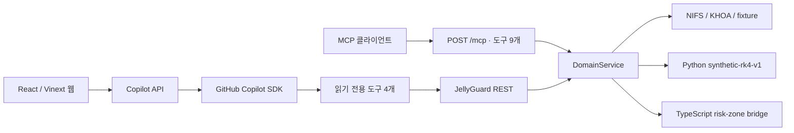

# MOPS <br> (Marine Organism Path Prediction System for Nuclear Power Plant Intake Clogging Risk)


> 경북 동해안의 해파리·해류·해양환경 자료를 한곳에서 점검하고, 한울 공개 데모의 조건부 이동영역과 감시격자 접근 여부를 설명하는 Copilot 기반 의사결정 지원 도구입니다.

**통합 기준 브랜치: `main`**

MOPS는 공공데이터를 무리하게 하나의 "위험 확률"로 합치지 않습니다. 자료의 출처와 시각, 실제·재생·합성 여부, 계산에 쓰지 못한 이유를 함께 보여주고, 근거가 부족한 요청은 `BLOCKED`로 멈춥니다.

> 조건부 이동영역은 주어진 관측·해류·수심·게이트 조건에서의 입자 연결 계산입니다. 해파리 생물량, 취수구 막힘 확률 또는 시설 위험도를 뜻하지 않습니다.

## 핵심 기능

- **통합 데이터 대시보드**: 해파리, 해류, 해양환경, 조건부 이동영역의 연결·품질 상태를 한 화면에서 확인합니다.
- **GitHub Copilot 데이터 매니저**: 자연어 질문을 읽기 전용 도구 호출로 바꾸고, JellyGuard가 반환한 근거만으로 답합니다.
- **공공데이터 수집**: NIFS 해파리·적조·정선해양 자료와 KHOA 해류 자료를 출처 정보와 함께 정규화합니다.
- **자료 상태 Gate**: `LIVE`, `CACHED`, `SYNTHETIC`을 구분하고, 미확인 유향이나 부족한 커버리지를 조용히 대체하지 않습니다.
- **조건부 수송 계산**: B0·B2·B3 합성 시나리오에서 3·6·12시간 이동 envelope와 member 보존 상태를 계산합니다.
- **감시격자·게이트 교차**: 공개 관측점 기반 감시격자를 지난 member 수와 게이트 선분을 통과한 member 수를 분리해 제공합니다.
- **REST·MCP 동시 제공**: 같은 `DomainService` 결과를 FastAPI REST와 Streamable HTTP MCP에서 동일한 digest로 제공합니다.

## 시스템 구성



현재 웹 채팅은 **GitHub Copilot SDK에 실제 접속**합니다. Microsoft Copilot Studio가 `POST /mcp`에 직접 연결되는 구성은 별도이며 아직 검증 대상에 포함하지 않습니다. `scripts/demo_check.py`는 Copilot을 대신하는 것이 아니라 MCP 계약을 독립적으로 검증하는 클라이언트입니다.

## 5분 안에 실행하기

### 요구사항

- Node.js 24 이상
- Python 3.11 이상
- [`uv`](https://docs.astral.sh/uv/)
- GitHub Copilot 사용 권한 및 Copilot CLI 로그인 또는 GitHub 토큰

### 설치 및 실행

```bash
git switch main
cp .env.example .env

npm install
npm --prefix packages/risk-zone install
npm --prefix engines/risk-zone install
uv sync --project backend --dev

npm run dev
```

실행 주소는 다음과 같습니다.

| 구성 요소 | 주소 |
| --- | --- |
| 통합 웹 화면 | `http://localhost:3100` |
| GitHub Copilot 도구 서버 | `http://127.0.0.1:3001` |
| JellyGuard REST | `http://127.0.0.1:8000/v1/*` |
| JellyGuard MCP | `POST http://127.0.0.1:8000/mcp` |
| 독립 JellyGuard 대시보드 | `http://127.0.0.1:8000/dashboard/` |

공공데이터 키가 없어도 기본 `fixture`·`synthetic` 모드로 화면과 전체 테스트를 실행할 수 있습니다.

## 환경변수

실제 인증값은 `.env`에만 저장합니다. `.env`는 Git에서 제외되며, 인증값에 `NEXT_PUBLIC_` 접두사를 붙이면 안 됩니다.

| 변수 | 필수 여부 | 설명 |
| --- | --- | --- |
| `COPILOT_GITHUB_TOKEN` | 선택 | Copilot CLI에 로그인하지 않은 경우 사용합니다. |
| `JELLYGUARD_LOCAL_REST_KEY` | 필수 | 로컬 REST 접근 키입니다. |
| `JELLYGUARD_MCP_CLIENT_KEY` | 필수 | MCP 접근 키입니다. REST 키와 다른 값을 사용합니다. |
| `JELLYGUARD_SOURCE_MODE` | 필수 | 기본값은 `fixture`, 실호출은 `live`입니다. |
| `JELLYGUARD_LIVE_ENABLED_SOURCES` | LIVE 시 필수 | 실제 호출할 소스만 쉼표로 명시합니다. |
| `JELLYGUARD_NIFS_*_KEY` | 선택 | NIFS 해파리·적조·정선해양 API 키입니다. |
| `JELLYGUARD_KHOA_KEY` | 선택 | KHOA 관측·ROMS API 키입니다. |
| `JELLYGUARD_RISK_ZONE_ENGINE_ENABLED` | 선택 | TypeScript 연결영역 엔진 활성화 여부입니다. |

LIVE 모드 예시는 다음과 같습니다.

```dotenv
JELLYGUARD_SOURCE_MODE=live
JELLYGUARD_LIVE_ENABLED_SOURCES=nifs_jelly_catalog,khoa_tw_recent_hanul,khoa_roms_live,nifs_redtide_list,nifs_soo_list
```

키가 없거나 허용 목록에 없는 소스는 호출하지 않습니다. LIVE 호출이 실패하더라도 fixture나 synthetic 자료로 자동 전환하지 않습니다.

## 데이터 소스와 사용 경계

발표·질의응답용 전체 원장에는 API별 주요 변수, 실제 계산 사용 여부, 제외 이유와 인증키 취급을 정리했습니다: [MOPS 데이터셋·API 사용 원장](docs/data-sources-and-usage.md)

| 소스 | 현재 역할 | 계산 사용 여부 |
| --- | --- | --- |
| `nifs_jelly_catalog` | NIFS 해파리 주간보고 게시물 목록 | 위치·밀도 관측으로 재해석하지 않음 |
| `khoa_tw_recent_hanul` | 한울 인근 표층 관측점 맥락 | 유향 규약 확인 전 수송 입력에서 제외 |
| `khoa_roms_live` | 한울 주변 ROMS 표층 면 유동장 | 발행시각·유향 규약 Gate를 통과할 때만 후보 가능 |
| `nifs_redtide_list` | 적조 맥락 | 수송 입력 아님 |
| `nifs_soo_list` | 정선해양 환경 맥락 | 수송 입력 아님 |
| fixture / synthetic | 재현 가능한 발표·계약 검증 | `SYNTHETIC_SCENARIO` 표시와 함께 사용 |

ROMS 공급 응답에는 모델 run time이 없어 `LIVE_UNKNOWN_AGE`가 될 수 있습니다. 유향 규약이 공급자 문서로 확인되지 않은 자료는 `DIRECTION_UNVERIFIED`로 표시합니다. 둘 다 장애를 숨기기 위한 상태가 아니라, 확인되지 않은 값을 계산에 넣지 않기 위한 Gate입니다.

## Copilot과 MCP 도구

### GitHub Copilot SDK 도구 4개

웹의 `/api/copilot`이 다음 읽기 전용 도구를 GitHub Copilot에 등록합니다.

| 도구 | 역할 |
| --- | --- |
| `list_datasets` | 통합 데이터셋 목록 조회 |
| `get_dataset_status` | 데이터셋 연결·갱신 상태 조회 |
| `check_dataset_quality` | 품질 점검 결과와 다음 조치 조회 |
| `get_risk_overview` | 조건부 이동영역·감시격자 요약 조회 |

### JellyGuard MCP 도구 9개

| 구분 | 도구 |
| --- | --- |
| 도메인 흐름 | `search_observations`, `get_field_status`, `run_transport`, `list_zones`, `intersect_zone`, `explain_run` |
| 공공데이터 원본 조회 | `get_ocean_current`, `get_jellyfish_reports`, `get_marine_environment` |

MCP는 `x-mcp-client-key` 또는 Bearer 토큰으로 보호합니다. 로컬 REST는 `x-jellyguard-local-key`를 사용하며, 외부 터널 호스트에서는 REST·대시보드 경로를 숨깁니다.

## 수송 엔진

`run_transport`의 `engine` 값으로 계산기를 선택합니다. 선택한 엔진은 응답의 `data.engine_version`과 결과 digest에 남습니다.

| 엔진 | 역할 | 주요 출력 |
| --- | --- | --- |
| `synthetic-rk4-v1` | Python 기반 재현 가능한 합성 RK4 수송 | 이동 envelope, member 보존 진단 |
| `risk-zone-connectivity-v1` | TypeScript 엔진을 ESM bridge로 호출 | 이동영역, 게이트 연결, 최초 교차 요청구간 |

`intersect_zone`의 `M of N`은 **감시격자 셀을 지난 member 수**, `gate_connectivity`의 `M of N`은 **게이트 선분을 통과한 member 수**입니다. 같은 실행에서도 서로 다른 값을 가질 수 있습니다.

`packages/risk-zone`은 MapLibre 기반 독립 지도 데모와 계산 API를 제공하고, `engines/risk-zone`은 JellyGuard가 직접 호출하는 의존성 없는 ESM bridge입니다. 발표에서는 두 결과를 하나의 확률처럼 합치지 않습니다.

## 데모 시나리오

1. `http://localhost:3100`을 열고 데이터셋 연결 상태를 확인합니다.
2. 빠른 질문 버튼 또는 채팅 입력으로 Copilot에게 데이터 상태를 질문합니다.
3. `http://127.0.0.1:8000/dashboard/`에서 `.env`의 로컬 REST 키로 연결합니다.
4. 시나리오를 실행해 3·6·12시간 이동 envelope와 감시격자 교차를 확인합니다.
5. 실행 ID, 입력 자료 모드, watermark, 차단 사유와 deterministic digest를 함께 확인합니다.

MCP와 TypeScript 엔진은 별도 터미널에서 점검할 수 있습니다.

```bash
backend/.venv/bin/python backend/scripts/demo_check.py \
  --client-key mcp-demo-key \
  --engine risk-zone-connectivity-v1
```

## 검증

```bash
npm run verify
```

이 명령은 다음을 순서대로 확인합니다.

1. 웹·Copilot 서버 lint
2. 통합 웹 production build
3. MapLibre 위험영역 패키지 build 및 테스트
4. JellyGuard 연동 TypeScript 엔진 build 및 테스트
5. Python 백엔드 계약·수치회귀·REST·MCP 테스트

2026-08-23 최종 통합 기준으로 웹 build와 lint, 위험영역 패키지 46개, 연동 엔진 42개, 백엔드 215개 테스트를 통과했습니다.

## 의도적으로 지키는 경계

- 실제 취수구 기하가 없으므로 공개 관측점 기반 `DEMO_GATE`만 사용하며 `facility_geometry`는 `null`입니다.
- 실제 해안선·수심이 없는 통합 시나리오에서는 합성 평탄 수심임을 결과에 표시합니다.
- 독립 후속관측 라벨이 없어 검증·학습 모듈을 만들지 않았습니다.
- 차압·유량·수거량 같은 시설자료가 없어 시설부담 또는 막힘 확률을 계산하지 않습니다.
- 미관측을 미출현으로 해석하지 않습니다.
- 계산 입력이 부족하면 잘린 결과를 READY로 반환하지 않고 이유와 함께 차단합니다.

## 현재 제한사항

- NIFS 해파리 LIVE 소스는 주간보고 목록이며 점좌표·정량밀도 관측이 아닙니다.
- KHOA 표층 관측과 ROMS 유향 규약은 공급자 확인 전까지 제한 상태로 표시될 수 있습니다.
- ROMS 모델 run time이 공개되지 않아 자료 나이를 확정할 수 없습니다.
- 적조·정선해양 context는 registry와 API에 있지만 통합 화면의 주요 시각화에는 아직 노출되지 않습니다.
- 시간 슬라이더, B0/B2/B3 동시 비교, 하단 환경 시계열은 통합 웹 화면에 아직 없습니다.
- Microsoft Copilot Studio의 MCP 직접 연결은 별도 설정·검증이 필요합니다.

## 저장소 구조

| 경로 | 역할 |
| --- | --- |
| `app/` | 통합 데이터 대시보드와 Copilot 채팅 UI |
| `server/` | GitHub Copilot SDK 및 읽기 전용 도구 서버 |
| `backend/src/jellyguard/` | FastAPI, MCP, 출처 Gate, 수송·감시격자 도메인 로직 |
| `backend/collectors/` | NIFS·KHOA 공공데이터 수집기 |
| `backend/dashboard/` | 외부 CDN에 의존하지 않는 독립 SVG 대시보드 |
| `packages/risk-zone/` | MapLibre 지도 데모와 TypeScript 계산 패키지 |
| `engines/risk-zone/` | JellyGuard 연동 TypeScript 엔진 및 ESM bridge |
| `docs/collectors/` | 수집기 설계와 데이터 통합 근거 |
